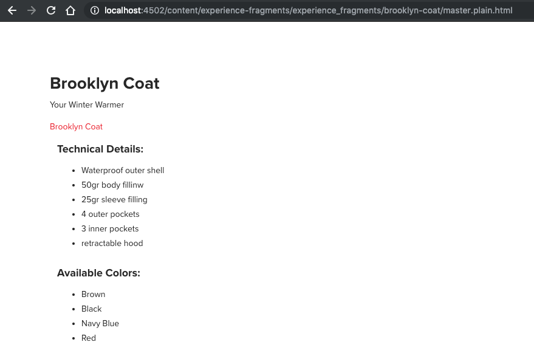

# Experience Fragments {#experience-fragments}

## The Basics {#the-basics}

An [Experience Fragment](/help/sites-authoring/experience-fragments.md) is a group of one or more components including content and layout that can be referenced within pages.

A primary or variant Experience Fragment, or both, uses the following:

* `sling:resourceType` : `/libs/cq/experience-fragments/components/xfpage`

As there is no `/libs/cq/experience-fragments/components/xfpage/xfpage.html`, it reverts to the following:

* `sling:resourceSuperType` : `wcm/foundation/components/page`

## The plain HTML rendition {#the-plain-html-rendition}

Using the `.plain.` selector in the URL, you can access the plain HTML rendition.

This ability is available from the browser. However, its primary purpose is to allow other applications (for example, third-party web apps, custom mobile implementations) to access the content of the Experience Fragment directly, using only the URL.

The plain HTML rendition adds the protocol, host, and context path to paths that are:

* of the type: `src`, `href`, or `action`

* or end with: `-src`, or `-href`

For example:

`.../brooklyn-coat/master.plain.html`

>[!NOTE]
>
>Links always reference the publishing instance. Third parties consume them, so they always call the link from the Publishing instance, not the Authoring instance..
>
>For more information, see [Externalizing URLs](/help/sites-developing/externalizer.md).



The plain rendition selector uses a transformer as opposed to additional scripts; the [`Sling Rewriter`](https://sling.apache.org/documentation/bundles/output-rewriting-pipelines-org-apache-sling-rewriter.html) is used as the transformer and configured at the following:

* `/libs/experience-fragments/config/rewriter/experiencefragments`

### Configure the HTML rendition generation {#configuring-html-rendition-generation}

The HTML rendition is generated using the `Sling Rewriter` Pipelines. The pipeline is defined at `/libs/experience-fragments/config/rewriter/experiencefragments`. The HTML Transformer supports the following options:

* `allowedCssClasses`
  * A RegEx expression which matches the CSS classes that should be left in the final rendition. 
  * Useful if the customer wants to strip away some specific CSS classes
* `allowedTags` 
  * A list of HTML tags to be allowed in the final rendition. 
  * By default, the system allows the following tags without configuration: html, head, title, body, img, p, span, ul, li, a, b, i, em, strong, h1, h2, h3, h4, h5, h6, br, `noscript`, div, link, and script.

It is recommended that you configure the rewriter using an overlay. See [Overlays](/help/sites-developing/overlays.md)

## Social variations {#social-variations}

Social variants can be posted on social media (text and image). In Adobe Experience Manager (AEM) these social variants can contain components; for example, text components, image components.

You can take the social post image and text from any image or text resource type, at any depth. The resources can come from either the building block or the layout container.

Social variations also allow building blocks and take them into consideration when making social actions (in the publish environment).

To post the correct text and image to the social media network, some conventions need to be respected if you are developing your own customized components.

The following properties must be used:

* For extracting the image,

    * `fileReference`
    * `fileName`

* For extracting the text,

    * `text`

Only components that use this convention are considered.

## Templates for Experience Fragments {#templates-for-experience-fragments}

>[!CAUTION]
>
>***Only*** [editable templates](/help/sites-developing/page-templates-editable.md) are supported for Experience Fragments.
>
>Experience Fragments can only be used on pages that are based on editable templates.

When developing a new template for Experience Fragments, you can follow the standard practices for an [editable template](/help/sites-developing/page-templates-editable.md).

To create an Experience Fragment template that the **Create Experience Fragment** wizard detects, you must follow one of these rule sets:

1. Both:

    1. The resource type of the template (the initial node) must inherit from:
       `cq/experience-fragments/components/xfpage`

    1. And the name of the template must begin with:
       `experience-fragments`
       Lets users create Experience Fragments in `/content/experience-fragments` as the `cq:allowedTemplates` property of this folder includes all the templates that have names beginning with `experience-fragment`. Customers can update this property to include their own naming scheme or template locations.

1. [Allowed templates](/help/sites-authoring/experience-fragments.md#configure-allowed-templates-folder) can be configured in the Experience Fragments console.
<!--
1. Add the template details manually in `cq:allowedTemplates` on the `/content/experience-fragment` node.
-->

<!-- >[!NOTE]
>
>[Allowed templates](/help/sites-authoring/experience-fragments.md#configuring-allowed-templates) can be configured in the Experience Fragments console.
-->

## Components for Experience Fragments {#components-for-experience-fragments}

[Developing components](/help/sites-developing/components.md) for use with/in Experience Fragments follow standard practices.

The only additional configuration is to ensure that the components are allowed on the template. This functionality is achieved with the [Content Policy](/help/sites-developing/page-templates-editable.md#content-policies).

## The Experience Fragment Link Rewriter Provider - HTML {#the-experience-fragment-link-rewriter-provider-html}

In AEM, you have the possibility to create Experience Fragments. An Experience Fragment:

* consists of a group of components together with a layout,
* can exist independently of an AEM page.

One of the use cases for such groups is for embedding content in third-party touchpoints, such as Adobe Target.

### Default link rewriting {#default-link-rewriting}

Using the [Export to Target](/help/sites-administering/experience-fragments-target.md) feature, you can:

* create an Experience Fragment,
* add components to it,
* and then export it as an Adobe Target Offer, either in HTML Format or JSON Format.

This feature can be [enabled on an author instance of AEM](/help/sites-administering/experience-fragments-target.md#Prerequisites). It requires a valid Adobe Target Configuration, and configurations for the Link Externalizer.

The Link Externalizer is used to determine the correct URLs needed when creating the HTML version of the Target Offer, which is then sent to Adobe Target. Adobe Target requires public access to all links in a Target HTML Offer. Publish the Experience Fragment and any resources that those links reference before you use them.


By default, when you construct a Target HTML Offer, a request is sent to a custom Sling selector in AEM. This selector is called `.nocloudconfigs.html`. As its name implies, it creates a plain HTML rendering of an Experience Fragment, but does not include cloud configurations (which would be superfluous information).

After you generate the HTML page, the `Sling Rewriter` pipeline makes modifications to the output:

1. The `html`, `head`, and `body` elements are replaced with `div` elements. The `meta`, `noscript` and `title` elements are removed (they are child elements of the original `head` element, and are not considered when replaced by the `div` element).

   This process is done to ensure that the HTML Target Offer can be included in Target Activities.

1. AEM modifies any internal links present in the HTML, so that they point to a published resource.

   To determine the links to modify, AEM follows this pattern for attributes of HTML elements:

    1. `src` attributes
    1. `href` attributes
    1. `*-src` attributes (like data-src, custom-src, and so on)
    1. `*-href` attributes (like `data-href`, `custom-href`, `img-href`, and so on)

   >[!NOTE]
   >
   >Usually, the internal links in the HTML are relative links, but there may be cases when custom components provide full URLs in the HTML. By default, AEM ignores these fully fledged URLs and makes no modifications.

   The links in these attributes pass through the AEM Link Externalizer `publishLink()` to recreate the URL as if it was on a published instance, and as such, publicly available.

When using an out-of-the-box implementation, the process described above is sufficient to generate the Target Offer from the Experience Fragment, and then export it to Adobe Target. However, there are some use cases that are not accounted for in this process including the following:

* Sling Mapping is available on the publishing instance only.
* Dispatcher redirects.

For these use cases, AEM provides the Link Rewriter Provider Interface.

### Link Rewriter provider interface {#link-rewriter-provider-interface}

For more complicated cases, not covered by the [default](#default-link-rewriting), AEM offers the Link Rewriter Provider Interface. This workflow is a `ConsumerType` interface that you can implement in your bundles, as a service. It bypasses the modifications AEM performs on internal links of an HTML offer as rendered from an Experience Fragment. This interface lets you customize the process of rewriting internal HTML links to align with your business needs.

Examples of use cases for implementing this interface as a service include:

* Sling Mappings are enabled on the publish instances, but not on the author instance.
* A Dispatcher or similar technology is used to redirect URLs internally.
* There are `sling:alias` mechanisms in place for resources.

>[!NOTE]
>
>This interface only processes the internal HTML links from the generated Target Offer.

The Link Rewriter Provider Interface ( `ExperienceFragmentLinkRewriterProvider`) is as follows:

```java
public interface ExperienceFragmentLinkRewriterProvider {

    String rewriteLink(String link, String tag, String attribute);

    boolean shouldRewrite(ExperienceFragmentVariation experienceFragment);

    int getPriority();

}
```

### How to use the Link Rewriter provider interface {#how-to-use-the-link-rewriter-provider-interface}

To use the interface, you first need to create a bundle containing a new service component that implements the Link Rewriter Provider Interface.

This service is used to plug into the Experience Fragment Export to Target rewriting to have access to the various links.

For example, `ComponentService`:

```java
import com.adobe.cq.xf.ExperienceFragmentLinkRewriterProvider;
import com.adobe.cq.xf.ExperienceFragmentVariation;
import org.osgi.service.component.annotations.Service;
import org.osgi.service.component.annotations.Component;

@Component
@Service
public class GeneralLinkRewriter implements ExperienceFragmentLinkRewriterProvider {

    @Override
    public String rewriteLink(String link, String tag, String attribute) {
        return null;
    }

    @Override
    public boolean shouldRewrite(ExperienceFragmentVariation experienceFragment) {
        return false;
    }

    @Override
    public int getPriority() {
        return 0;
    }

}
```

For the service to work, there are now three methods that need to be implemented inside the service:

* ` [shouldRewrite](#shouldrewrite)`
* ` [rewriteLink](#rewritelink)`

    * `rewriteLinkExample2`

* ` [getPriority](#priorities-getpriority)`

#### shouldRewrite {#shouldrewrite}

You need to indicate to the system whether it needs to rewrite the links when a call is made for Export to Target on a certain Experience Fragment variation. You can do this **implementation** by using the following method:


`shouldRewrite(ExperienceFragmentVariation experienceFragment);`

For example:

```java
@Override
public boolean shouldRewrite(ExperienceFragmentVariation experienceFragment) {
    return experienceFragment.getPath().equals("/content/experience-fragment/master");
}
```

This method receives, as a parameter, the Experience Fragment Variation that the Export to Target system is currently rewriting.

In the example above, you would like to rewrite:

* links present in `src`

* `href` attributes only

* for a specific Experience Fragment:
  `/content/experience-fragment/master`

The Export to Target system ignores any other Experience Fragments that pass through it, and this service does not affect them.

#### rewriteLink {#rewritelink}

For the Experience Fragment variation impacted by the rewriting process, it proceeds to let the service handle the link rewriting. Every time a link is encountered in the internal HTML, the following method is invoked:

`rewriteLink(String link, String tag, String attribute)`

As input, the method receives the parameters:

* `link`
  The `String` representation of the link that is being processed. Usually a relative URL pointing to the resource in the author instance.

* `tag`
  The name of the HTML element that is being processed.

* `attribute`
  The exact attribute name.

For example, if the Export to Target system is processing this element, you can define `CSSInclude` as:

```java
<link rel="stylesheet" href="/etc.clientlibs/foundation/clientlibs/main.css" type="text/css">
```

The call to the `rewriteLink()` method is done using these parameters:

```java
rewriteLink(link="/etc.clientlibs/foundation/clientlibs/main.css", tag="link", attribute="href" )
```

When you create the service, you can make decisions based on the given input, and then rewrite the link accordingly.

For the example, you would like to remove the `/etc.clientlibs` part of the URL and add the appropriate external domain. To keep things simple, consider that you have access to a Resource Resolver for your service, as in `rewriteLinkExample2`:

>[!NOTE]
>
>For more information on how to get a resource resolver through a service user, see [Service Users in AEM](/help/sites-administering/security-service-users.md).

```java
private ResourceResolver resolver;

private Externalizer externalizer;

@Override
public String rewriteLink(String link, String tag, String attribute) {

    // get the externalizer service
    externalizer = resolver.adaptTo(Externalizer.class);
    if(externalizer == null) {
        // if there was an error, then we do not modify the link
        return null;
    }

    // remove leading /etc.clientlibs from resource link before externalizing
    link = link.replaceAll("/etc.clientlibs", "");

    // considering that we configured our publish domain, we directly apply the publishLink() method
    link = externalizer.publishLink(resolver, link);

    return link;
}
```

>[!NOTE]
>
>If the above method returns `null`, then the Export to Target system leaves the link as it is, a relative link to a resource.

#### Priorities - getPriority {#priorities-getpriority}

You may need several services to support different types of Experience Fragments. You can also use a Generic Service to externalize and map all Experience Fragments. In these cases, conflicts about which service to use might arise, so AEM provides the possibility to define **Priorities** for different services. The priorities are specified by using the method:

* `getPriority()`

This method allows the use of several services where the `shouldRewrite()` method returns true for the same Experience Fragment. The service that returns the highest number from its `getPriority()`method is the service that handles the Experience Fragment Variation.

As an example, you can have a `GenericLinkRewriterProvider` that handles the basic mapping for all Experience Fragments and when the `shouldRewrite()` method returns `true` for all Experience Fragment Variations. For several specific Experience Fragments, you may want special handling, so in this case, you can provide a `SpecificLinkRewriterProvider` for which the `shouldRewrite()` method returns true only for some Experience Fragment Variations. To make sure that `SpecificLinkRewriterProvider` is chosen to handle those Experience Fragment Variations, it must return in its `getPriority()` method a higher number than `GenericLinkRewriterProvider.`
