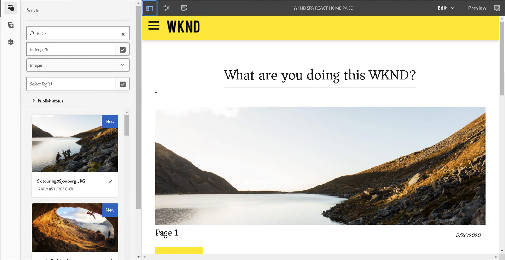
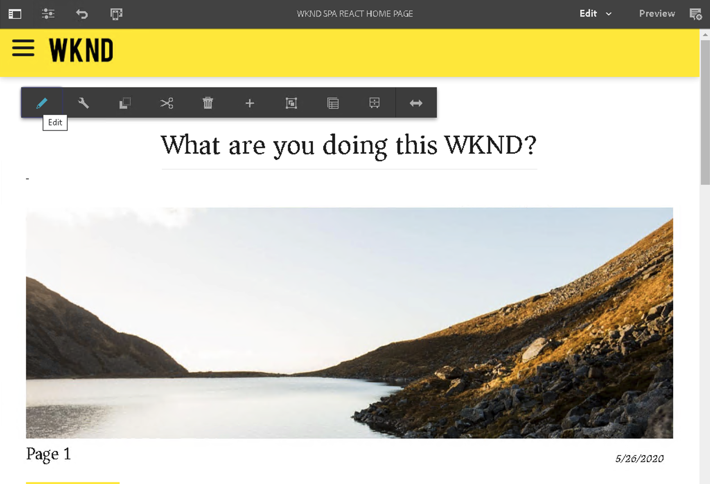
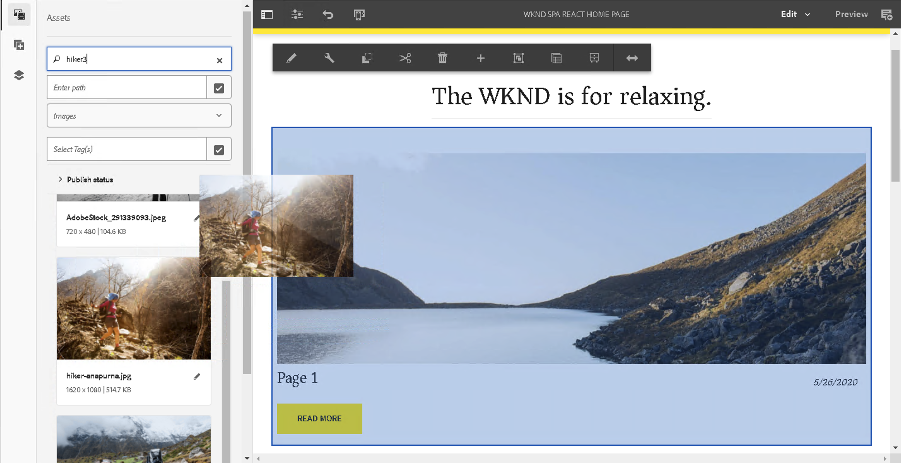

# SPA Introduction and Walkthrough {#spa-introduction-and-walkthrough}

Single page applications (SPAs) can offer compelling experiences for website users. Developers want to be able to build sites using SPA frameworks and authors want to seamlessly edit content within AEM for a site built using such frameworks.

The SPA Editor offers a comprehensive solution for supporting SPAs within AEM. This article walks through using a basic SPA application for authoring and shows how it relates to the underlying AEM SPA Editor.

>[!NOTE]
>
>The SPA Editor is the recommended solution for projects that require SPA framework-based client-side rendering (for example, React or Angular).

## Introduction {#introduction}

### Article Objective {#article-objective}

This article introduces the basic concepts of SPAs before leading the reader through a walkthrough of the SPA editor by using a simple SPA application to demonstrate basic content editing. It then dives down into the construction of the page and how the SPA application relates to and interacts with the AEM SPA Editor.

The goal of this introduction and walkthrough is to demonstrate to an AEM developer why SPAs are relevant, how they generally work, how a SPA is handled by the AEM SPA Editor, and how it is different from a standard AEM application.

## Requirements {#requirements}

The walkthrough is based on standard AEM functionality and the sample WKND SPA Project app. To follow along with this walkthrough, you must have the following available.

* [AEM version 6.5.4 or newer](/help/release-notes/release-notes.md)
  * You must have admin rights to the system.
* [The sample WKND SPA Project app available on GitHub](https://github.com/adobe/aem-guides-wknd-spa)
  * Download the [latest release of the React app.](https://github.com/adobe/aem-guides-wknd-spa/releases) It will be named similar to `wknd-spa-react.all.classic-X.Y.Z-SNAPSHOT.zip`.
  * Download the [latest sample images](https://github.com/adobe/aem-guides-wknd-spa/releases) for the app. It will be named similar to `wknd-spa-sample-images-X.Y.Z.zip`.
  * [Use package manager](/help/sites-administering/package-manager.md) to install the packages as a you would any other package in AEM.
  * The app does not need to be installed using Maven for the purposes of this walkthrough.

>[!CAUTION]
>
>This document uses the [WKND Spa Project app](https://github.com/adobe/aem-guides-wknd-spa) for demonstration purposes only. Do not use for any project work.
>
>Any AEM project should use the [AEM Project Archetype,](https://experienceleague.adobe.com/docs/experience-manager-core-components/using/developing/archetype/overview.html) which supports SPA projects using React or Angular and uses the SPA SDK.

### What is a SPA? {#what-is-a-spa}

A single-page application (SPA) differs from a conventional page in that it is rendered client-side and is primarily JavaScript-driven, relying on Ajax calls to load data and dynamically update the page. Most or all content is retrieved once in a single page load with additional resources loaded asynchronously as needed based on user interaction with the page.

This reduces the need for page refreshes and presents an experience to the user that is seamless, fast, and feels more like a native app experience.

The AEM SPA Editor allows front-end developers to create SPAs that can be integrated into an AEM site, allowing the content authors to edit the SPA content as easily as any other AEM content.

### Why a SPA? {#why-a-spa}

By being faster, fluid, and more like a native application, a SPA becomes a very attractive experience not only for the visitor of the webpage, but also for marketers and developers due to the nature of how SPAs work.

**Visitors**

* Visitors want native-like experiences when they interact with content.
* There is clear data that the faster a page, the more likely a conversion will occur.

**Marketers**

* Marketers want to offer rich, native-like experiences to entice visitors to fully engage with content.
* Personalization can make these experiences even more compelling.

**Developers**

* Developers want a clean separation of concerns between content and presentation.
* Clean separation makes the system more extensible and allow for independent front-end development.

### How Does a SPA Work? {#how-does-a-spa-work}

The primary idea behind a SPA is that calls and dependency on a server are reduced to minimize delays caused by server calls so that the SPA approaches the responsiveness of a native application.

In a traditional, sequential webpage, only the data needed for the immediate page is loaded. This means that when the visitor moves to another page, the server is called for the additional resources. Additinoal calls might be necessary as the visitor interacts with elements on the page. These multiple calls can give a sense of lag or delay as the page has to catch up with the visitor's requests.

For a more fluid experience, that approaches what a visitor expects from mobile, native apps, a SPA loads all necessary data for the visitor on the first load. Although this might take a bit longer at first, it then eliminates the need for additional server calls.

By rendering on the client side, page element react faster, and interactions with the page by the visitor are immediate. Any additional data that might be needed is called asynchronously to maximize the speed of the page.

>[!NOTE]
>
>For technical details on how SPAs work in AEM, see the article [Getting Started with SPAs in AEM](/help/sites-developing/spa-getting-started-react.md).
>
>For a closer look at the design, architecture, and technical workflow of the SPA Editor, see the article [SPA Editor Overview](/help/sites-developing/spa-overview.md).

## Content Editing Experience with SPA {#content-editing-experience-with-spa}

When an SPA is built to use the AEM SPA Editor, the content author notices no difference when editing and creating content. Common AEM functionality is available and no changes to the author's workflow is required.

1. Edit the WKND SPA Project app in AEM.

   `http://<host>:<port>/editor.html/content/wknd-spa-react/us/en/home.html`

   

1. Select a heading component and notice that a toolbar appears like for any other component. Select **Edit**.

   

1. Edit the content as normal within AEM. The changes are persisted.

   

   >[!NOTE]
   >
   >See the [SPA Editor Overview](spa-overview.md#requirements-limitations) for further information about the in place text editor and SPAs.

1. Use the Assets Browser to drag-and-drop a new image into an image component.

   

1. The change is persisted.

   

Additional authoring tools such as dragging-and-dropping additional components on the page, rearranging components, and modifying the layout are supported as in any non-SPA application.

>[!NOTE]
>
>The SPA Editor does not modify the DOM of the application. The SPA itself is responsible for the DOM.
>
>To see how this works, continue on to the next section of this article [SPA Apps and the AEM SPA Editor](#spa-apps-and-the-aem-spa-editor).

## SPA Apps and the AEM SPA Editor {#spa-apps-and-the-aem-spa-editor}

Experiencing how an SPA behaves for the end user and then inspecting the SPA page helps to better understand how an SAP app works with the SPA Editor in AEM.

### Using an SPA Application {#using-an-spa-application}

1. Load the WKND SPA Project application either on the publish server or using the option **View as Published** from the **Page Information** menu in the page editor.

   `http://<host>:<port>/content/wknd-spa-react/us/en/home.html`

   

   Note the pages structure including navigation to child pages, weather widget, and articles.

1. Navigate to a child page using the menu and see that the page loads immediately without the need for a refresh.

   

1. Open your browser's built-in developer tools and monitor network activity as you navigate the child pages.

   

   There is very little traffic as you move from page to page in the app. The page is not reloaded and only the new images are requested.

   The SPA manages the content and routing entirely on the client side.

So if the page is not reloaded when navigating through the child pages, how is it loaded?

The next section, [Loading an SPA Application,](#loading-an-spa-application) digs deeper into the mechanics of loading the SPA and how content can be loaded synchronously and asynchronously.

### Loading an SPA Application {#loading-an-spa-application}

1. If not already loaded, load the WKND SPA Project app either on the publish server or using the option **View as Published** from the **Page Information** menu in the page editor.

   `http://<host>:<port>/content/wknd-spa-react/us/en/home.html`

   

1. Use the built-in tool of your browser to view the source of the page.
1. The content of the source is extremely limited.

   * The page does not have any content within its body. It is primarily made up of stylesheets and a call to various scripts such as `clientlib-react.min.js`.
   * These scripts are the primary drivers of this application and are responsible for rendering all content.

1. Use your browser's built-in tools to inspect the page. See the content of the DOM fully loaded.

   

1. Switch to the **Network** tab of the developer tools and reload the page.

   Ignoring image requests, the primary resources loaded for the page are the page itself, CSS, the React JavaScript, its dependencies, and JSON data for the page.

   

1. Load the `react.model.json` in a new tab.

   `http://<host>:<port>/content/wknd-spa-react/us/en/home.model.json`

   

   The AEM SPA Editor uses [AEM Content Services](/help/assets/content-fragments/content-fragments.md) to deliver the entire content of the page as a JSON model.

   By implementing specific interfaces, Sling Models provide the information necessary to the SPA. The delivery of the JSON data is delegated downward to each component (from page, to paragraph, to component, and so on).

   Each component chooses what it exposes and how it is rendered (server-side with HTL or client-side with React). This article focuses on client-side rendering with React.

1. The model can also group pages together so that they are loaded synchronously, reducing the number of page reloads needed.

   In the example of WKND SPA Project app, the `home`, `page-1`, `page-2`, and `page-3` pages are loaded synchronously, since visitors commonly visit all of those pages.

   This behavior is not mandatory and is fully definable.

   

1. To view this difference in behavior, reload the page and clear the network activity of the developer tools. Navigate to `page-1` in the page menu and see that the only network activity is a request for the image of `page-1`. `page-1` itself does not need to load.

   

### Interaction with the SPA Editor {#interaction-with-the-spa-editor}

Using the sample WKND SPA Project application, it is clear how the app behaves and is loaded when published, using content services for JSON content delivery and asynchronous loading of resources.

Additionally, for the content author, content creation using a SPA editor is seamless within AEM.

In the following section we will explore the contract that allows the SPA Editor to relate components within the SPA to AEM components and achieve this seamless editing experience.

1. Load the WKND SPA Project application in the editor and switch to **Preview** mode.

   `http://<host>:<port>/editor.html/content/wknd-spa-react/us/en/home.html`

1. Using your browser's built-in developer tools, inspect the content of the page. Using the selection tool, select an editable component on the page and view the element detail.

   The component has a new data attribute `data-cq-data-path`.

   

   For example

   `data-cq-data-path="/content/wknd-spa-react/us/en/home/jcr:content/root/responsivegrid/text`

   This path allows the retrieval and association of the edit context configuration object of each component.

   This is the only markup attribute required for the editor to recognize this as an editable component within the SPA. Based on this attribute, the SPA Editor will determine which editable configuration is associated with the component, so that the correct frame, toolbar, and so on, is loaded.

   Some specific class names are also added for marking placeholders and for asset drag-and-drop functionality.

   >[!NOTE]
   >
   >This is a change in behavior from server-side rendered pages in AEM, where there is a `cq` element inserted for each editable component.
   >
   >
   >This approach in SPA removes the need to inject custom elements, relying only an additional data attribute, making the markup simpler for the frontend developer.

## Next Steps {#next-steps}

Now that you understand the SPA editing experience in AEM and how a SPA relates to the SPA Editor, take a deeper dive into understanding how a SPA is built.

* [Getting Started with SPAs in AEM](/help/sites-developing/spa-getting-started-react.md) shows how a basic SPA is built to work with the SPA Editor in AEM
* [SPA Editor Overview](/help/sites-developing/spa-overview.md) goes into more depth into the communication model between AEM and the SPA.
* [Developing SPAs for AEM](/help/sites-developing/spa-architecture.md) describes how to engage front-end developers to develop a SPA for AEM and how SPAs interact with AEM's architecture.
